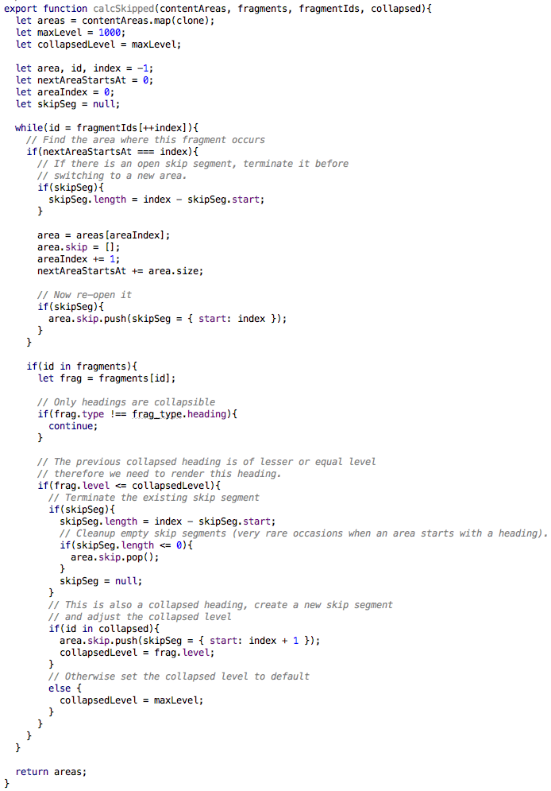
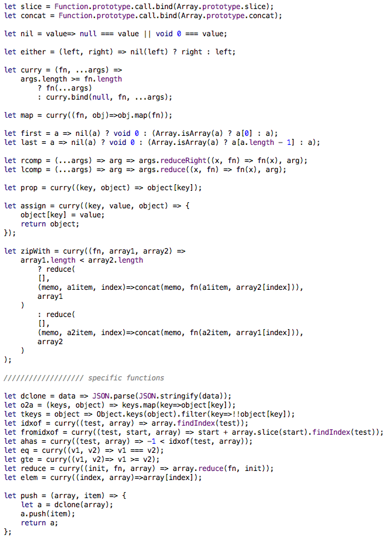
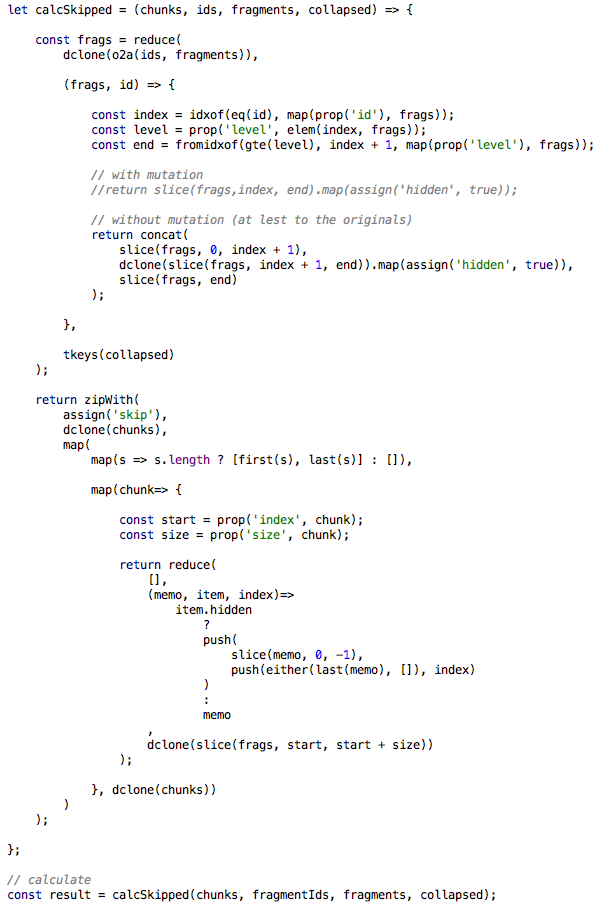
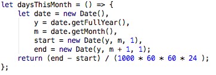
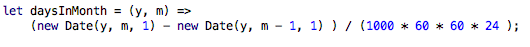
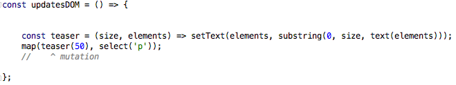
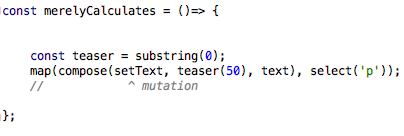

# FP & ES

beggining with functional style programming in ES2015

 Goran Peoski (<a href="https://twitter.com/azder">@azder</a>)

   

online: <a href="https://azder.github.io/es-funx-basic/">azder.github.io/es-funx-basic</a>

---

## What's this about

- practice, not theory
- how to get accustomed to FP
- what worked for me and might work for you

---

## In the beginning 

   

.center[<cite>was the keyword</cite>]

 

.center[<cite>and the keyword was with problem</cite>]

 

.center[<cite>and problem was the keyword</cite>]

---

## GOTO

.center[]

---

## no more GOTO

- structured programming
- Böhm-Jacopini proof (1966) 
  - [en.wikipedia.org/wiki/Structured_program_theorem](https://en.wikipedia.org/wiki/Structured_program_theorem)
- scared of obscure programs b/c introduction of additional local variables

---

## The structured way

.center[]

---

## The ( lil' bit mo') Functional way

.center[

]

---

## Why bother?

- separation of concerns
- helps debugging and testing
- easier to focus (subproblems and big picture)

---

## How-To

### Videos
- _Hey Underscore, You're Doing It Wrong!_ @ [youtu.be/m3svKOdZijA](https://youtu.be/m3svKOdZijA)
    
- _Hardcore Functional Programming in JavaScript_
  - @ [app.pluralsight.com/courses/hardcore-functional-programming-javascript](http://app.pluralsight.com/courses/hardcore-functional-programming-javascript)

### Languages
- _Haskell_  @ [www.haskell.org](https://www.haskell.org/)
- Elm @ [elm-lang.org/](http://elm-lang.org/)

### Meetups
- _Hacklab KIKA_ @ [status.spodeli.org](http://status.spodeli.org/)

---

## Learn about Libraries
   - Underscore [underscorejs.org](http://underscorejs.org/)
   - Lodash [lodash.com/docs](https://lodash.com/docs)
   - Ramda [ramdajs.com/0.19.1/docs/](http://ramdajs.com/0.19.1/docs/)

---

## Identify Symptoms

- Custom names:  
  - `let nextAreaStartsAt = 0;`
  
- Looping patterns: 
  - `while(id = fragmentIds[++index]){`
           
- Glue code:
  - `.then( people => _.map(people, f) )`
      
- Side effects
  - `Object.freeze()`

---

## Then Separate concerns 

- discover hidden inputs
.pad.flex[

]

- separate mutation from calculation (examples/mutation)
.pad.flex[

]

- combine calculations into pipeline, then do the mutation

---

## Pure Functions 
  - testable
  - portable
  - memoizable
  - paralelizable 

---

## All Functions
    
- nouns, not verbs

- collection of pairs: `{ (x1,y1), (x2, y2), ... }`

  - y = f(x)
  - one result per variable combination
  
- _point-free_ style
        
---
  
## Utilities

- functions for operations
  - `prop('b',a)` instead of `a.b`
  
- `map(fn,obj)`
  - just calls `.map` on an object (container)

- `curry(fn,...args)`
 - binds (fixates) and returns new function, until...
 - when all arguments are provided, executes

- `compose(f1,f2,f3,...fn)`
 - creates new function
 - _point-free_ style

---
   
## Demo
  
.center.small[[here](demo/index.html)]
   
.center.middle[
<iframe src="demo/index.html" width="720px" height="320px" />
]

---

## The End

Thanks for sticking around until the very end :)
        
???
        
- objectify, stringify
- prop
- for replaced by map 
- composition (lcomp, rcomp)
- curry       
- operators as functions
- functions that return undefined 
    - `console.log` vs `tap`, 
    - `Array.push`
- functions that take arguments in _weird_ order
  - `lodash.map(collection, [iteratee=_.identity])`
  - `jQuery().map( callback )` 
    w/ `callback( index, domElement )`
  - `jQuery.map( array, callback )` 
    w/ `callback( elementOfArray, indexInArray )`
  - `underscore.pick(object,[props])`
    

- start small (only business logic)
- abstract `new` keyword away
- in fact, most keywords and operators should be functions

- functors and monads - `Array` as a functor/monad
  
- Functor Laws
  - identity

        map(id) === id        
  - composition
  
        compose(map(f),map(g)) === map(compose(f,g))
